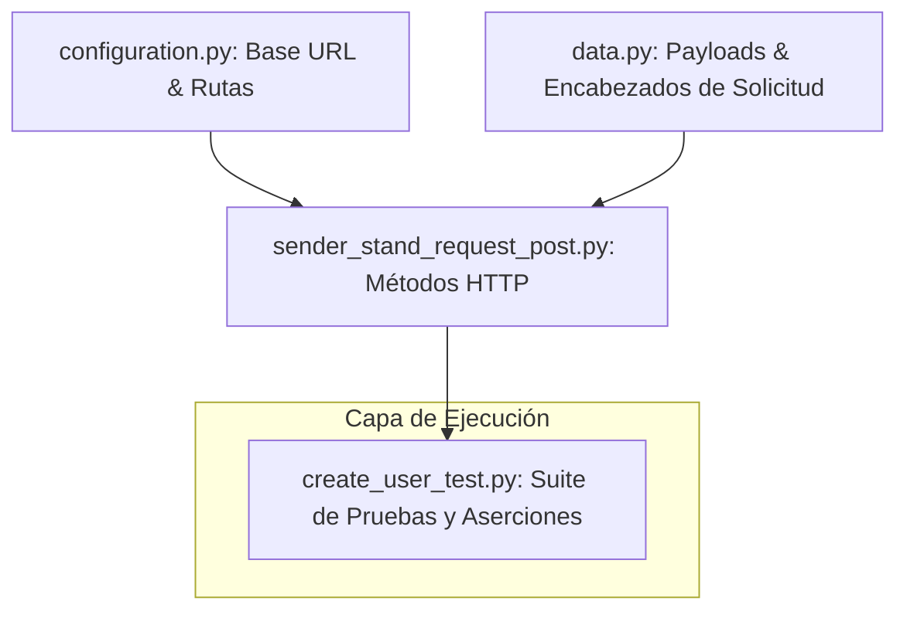

# 🛒 Urban Grocers - Framework de Automatización de Pruebas de API


📖 *Leer esta documentación en otros idiomas:* [English (Inglés)](README.md

---

Este repositorio contiene una suite de pruebas automatizadas sólida y estructurada, diseñada para validar la funcionalidad del backend de la API REST para la plataforma **Urban Grocers**. El framework se enfoca en verificar reglas de negocio, valores límite, integridad de datos y la lógica de manejo de errores del backend durante los flujos de creación de usuarios.

## 🧪 Flujos Automatizados Cubiertos
* **Escenarios Positivos:** Validación de la creación exitosa de usuarios utilizando parámetros `firstName` válidos y estructuras de carga útiles conformes.
* **Escenarios Negativos:** Pruebas de respuesta del sistema frente a cadenas vacías, caracteres especiales, tipos de datos incorrectos (enteros) e inyecciones de límites de longitud máxima.
* **Validación de Respuestas:** Verificación de códigos de estado HTTP correctos (por ejemplo, `201 Created`, `400 Bad Request`) y la integridad del análisis estructural de JSON.

## 🛠️ Stack Tecnológico y Técnicas de Ingeniería
* **Lenguaje:** Python 3.12+
* **Ejecutor de Pruebas:** Pytest
* **Cliente HTTP:** Librería Requests
* **Patrones de Automatización:** Separación modular de responsabilidades. Las configuraciones de endpoints (`configuration.py`), los payloads de solicitudes (`data.py`) y los métodos de utilidad HTTP atómicos (`sender_stand_request_post.py`) están estrictamente desacoplados de la capa de aserciones de prueba (`create_user_test.py`).

## 📐 Arquitectura y Flujo de Datos
El siguiente diagrama representa cómo interactúan los módulos del framework desde la configuración base hasta la ejecución de las aserciones funcionales:



## 📐 Estructura del Repositorio
```text
📦 urban-grocers-api-automation
 ┣ 📂 resources                  # Registros de texto, mocks estáticos y artefactos de ejecución.
 ┣ 📜 configuration.py          # Rutas base de la API y parámetros de enrutamiento centralizados.
 ┣ 📜 data.py                   # Diccionarios de payloads, mapeo de encabezados y datos estáticos.
 ┣ 📜 sender_stand_request_get.py   # Envolturas de utilidad para solicitudes HTTP GET.
 ┣ 📜 sender_stand_request_post.py  # Envolturas de utilidad para solicitudes HTTP POST.
 ┣ 📜 create_user_test.py       # Suite principal de pruebas funcionales y condicionales.
 ┣ 📜 .gitignore                # Exclusiones de Git para entornos virtuales y cachés de IDE.
 ┣ 📜 README.es.md              # Documentación del proyecto en Español.
 ┗ 📜 README.md                 # Documentación del proyecto en Inglés.
```
## 🚀 Getting Started & Execution Instructions
### 1. Clone the Repository
```bash 
git clone [https://github.com/hernanvargas-byte/api_stand_tests.git](https://github.com/hernanvargas-byte/api_stand_tests.git)
cd api_stand_tests
```
### 2. Configure the Virtual Environment
```bash
python -m venv .venv
# On Windows (Git Bash / Command Prompt):
source .venv/Scripts/activate
# On macOS/Linux:
source .venv/bin/activate
```
### 3. Install Dependencies
```bash
pip install requests pytest
```

### 4. Run the Test Suite
To execute all functional API tests with detailed verbose output, run:
```bash
pytest create_user_test.py -v
```