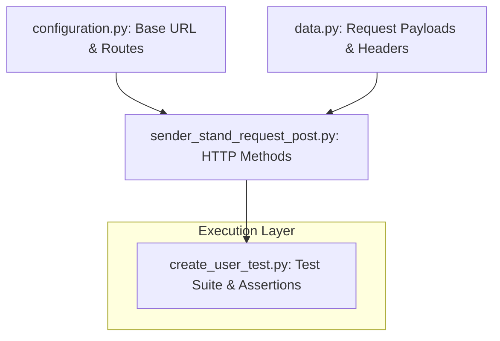

# 🛒 Urban Grocers - API Automation Testing Framework


📖 *Read this documentation in other languages:* [Español (Spanish)](README.es.md)

---

This repository contains a robust, automated testing suite designed to validate the REST API backend functionality for the **Urban Grocers** platform. The framework focuses on verifying business rules, boundary values, data integrity, and backend error-handling logic during user creation workflows.

## 🧪 Automated Workflows Covered
* **Positive Scenarios:** Validation of successful user creation using compliant `firstName` parameters.
* **Negative Scenarios:** Testing system response with empty strings, special characters, integers, and length limit boundary injections.
* **Response Validation:** Asserting correct HTTP status codes (e.g., 201 Created, 400 Bad Request) and structure parsing.

## 🛠️ Tech Stack & Engineering Techniques
* **Language:** Python 3.12+
* **Test Runner:** Pytest
* **HTTP Client:** Requests
* **Automation Patterns:** Modular separation of concerns. Endpoints configurations (`configuration.py`), request payloads (`data.py`), and atomic request methods (`sender_stand_request_post.py`) are strictly decoupled from the test assertions layer (`create_user_test.py`).

## 📐 Architecture & Data Flow
El siguiente diagrama representa cómo interactúan los módulos del framework desde la configuración base hasta la ejecución de las aserciones funcionales:



## 📐 Repository Structure
```text
📦 urban-grocers-api-automation
 ┣ 📂 resources                  # Text logs, static mocks, and test artifacts.
 ┣ 📜 configuration.py          # Centralized API base URLs and endpoint routes.
 ┣ 📜 data.py                   # Request body dictionaries and headers mapping.
 ┣ 📜 sender_stand_request_get.py   # HTTP GET request wrappers.
 ┣ 📜 sender_stand_request_post.py  # HTTP POST request wrappers.
 ┣ 📜 create_user_test.py       # Main test suite containing positive and negative test cases.
 ┣ 📜 .gitignore                # Target exclusions for virtual environments and IDE caches.
 ┣ 📜 README.es.md              # Project documentation in Spanish.
 ┗ 📜 README.md                 # Project documentation in English.
```
## 🚀 Configuración Inicial e Instrucciones de Ejecución
### 1. Clonar el Repositorio
```bash 
git clone [https://github.com/hernanvargas-byte/api_stand_tests.git](https://github.com/hernanvargas-byte/api_stand_tests.git)
cd api_stand_tests
```
### 2. Configurar el Entorno Virtual
```bash
python -m venv .venv
# En Windows (Git Bash / Símbolo del sistema):
source .venv/Scripts/activate
# En macOS/Linux:
source .venv/bin/activate
```
### 3. Instalar Dependencias
```bash
pip install requests pytest
```

### 4. Ejecutar la Suite de Pruebas
Para ejecutar todas las pruebas funcionales de la API con un desglose detallado en la consola, ejecuta:
```bash
pytest create_user_test.py -v
```